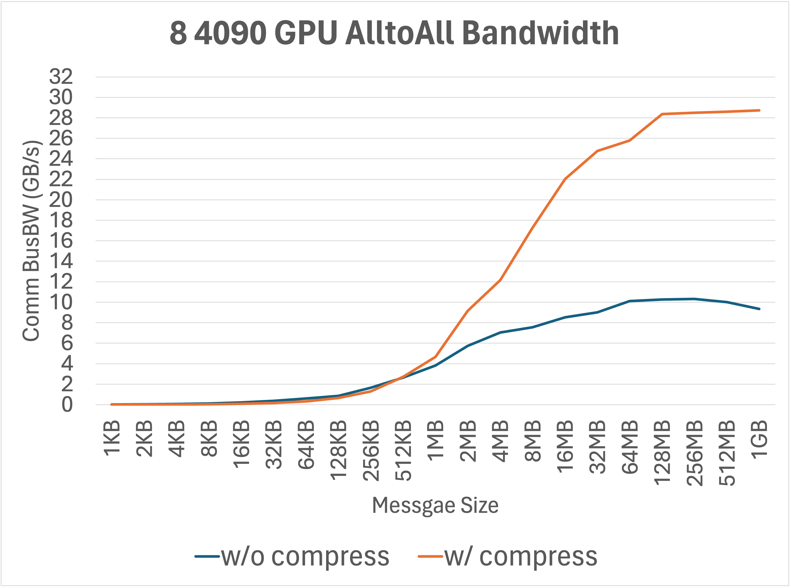
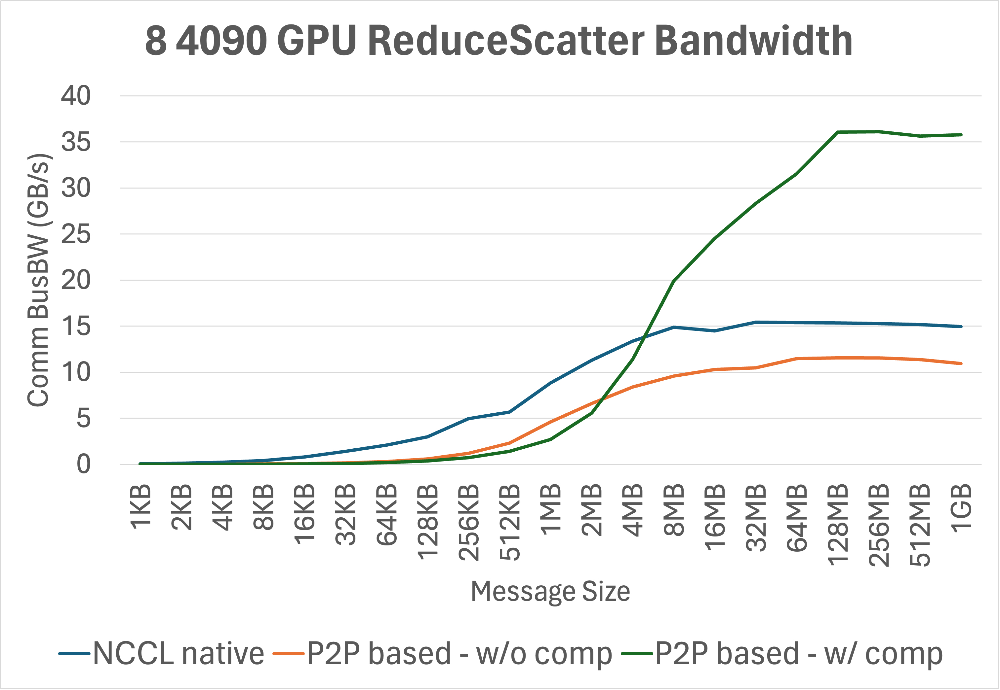
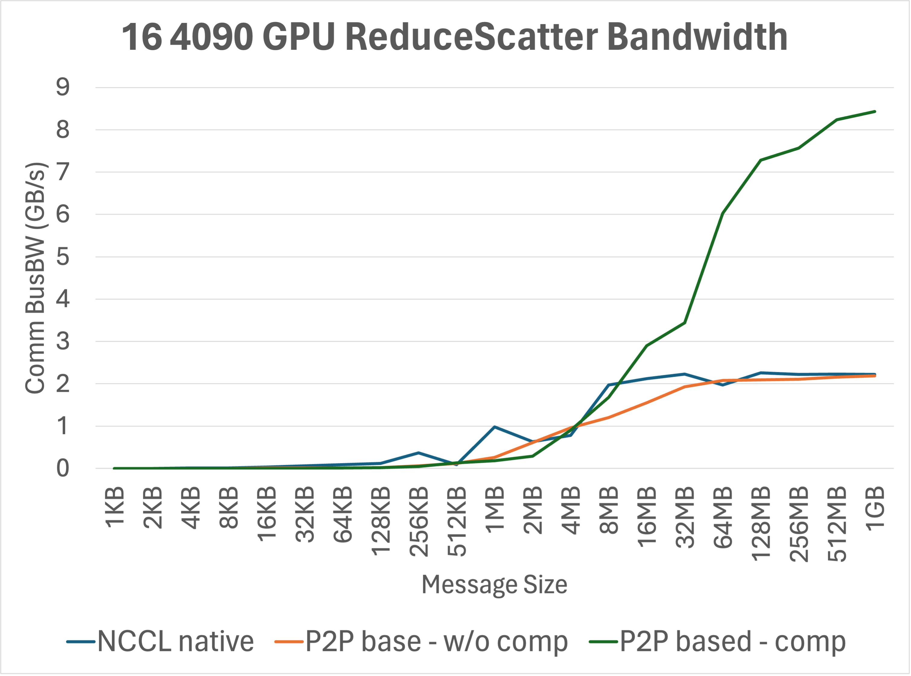
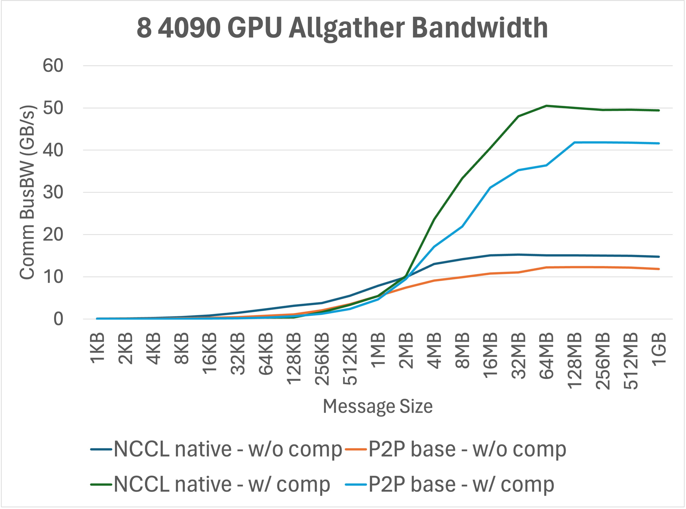
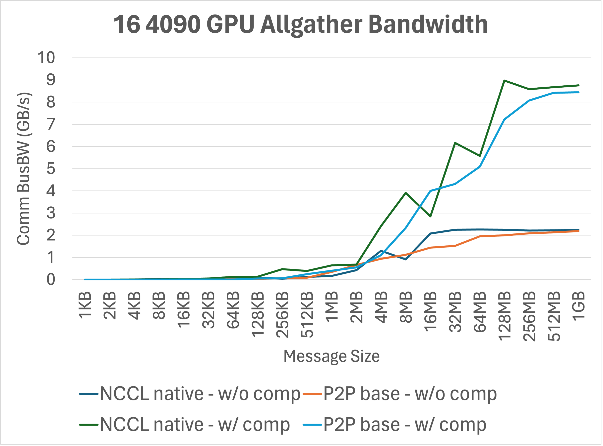
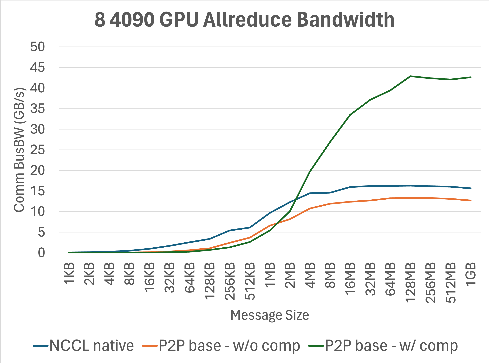
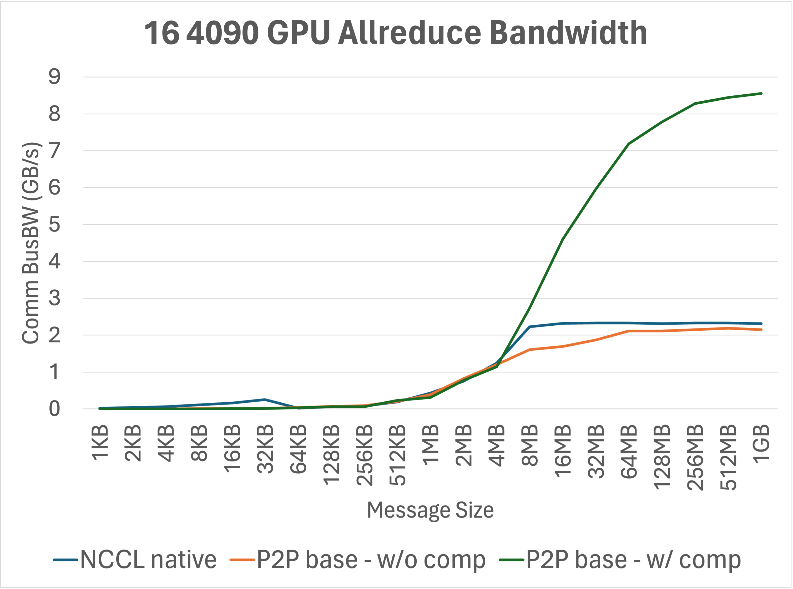

# COCCL

Compression and precision cO-awareness Collective Communication Library implemented based on NCCL. 

## Introduction

COCCL is a compression-aware GPU collective communication library built upon NCCL 2.21.5. It systematically integrates compression support into NCCL and re-wraps its API to provide a suite of collective communication pipelines optimized with high-performance GPU compression techniques. COCCL is designed to be extensible, supporting various lossless compression methods (e.g., low-bit quantization). We acknowledge that while some existing works support collective communication with compression, such as [1]-[5], COCCL is the first to support various collective primitives with configurable compression algorithms and achieve compression-and-precision co-optimization within NCCL (rather than MPI).

For instance, leveraging the minmaxUint8 quantization algorithm, COCCL achieves approximately 3× speedup on collective communication operations such as all-reduce, all-gather, reduce-scatter, and all-to-all. Additionally, it retains NCCL's native GPU data transfer optimizations, improving transmission efficiency across heterogeneous hardware interconnect systems. COCCL is particularly beneficial for applications requiring intensive collective communication, including large-scale model training, inference systems, and scientific computing.

Moving forward, we plan to incorporate NVSHMEM support by migrating dependencies from [DeepEP](https://github.com/deepseek-ai/DeepEP) and integrating selected optimization mechanisms to further enhance COCCL's communication performance.

(C) 2025 by Institute of Computing Technology, Chinese Academy of Sciences. See [COPYRIGHT](https://github.com/hpdps-group/coccl/blob/main/LICENSE.txt) in top-level directory.

- Developers:  Xingchen Liu, Haoran Kong, Zheng Wei, Liyang Zhao, Yufan Wang, Jingwu Yang
- Advisors: [Dingwen Tao](https://www.dingwentao.com/), [Guangming Tan](https://tanniu.github.io/)

#### Tested GPU Platforms

- NVIDIA GeForce RTX 4090 (Ada Lovelace Architecture)
- NVIDIA Tesla A800 (Ampere Architecture)

## Build

To build the library :

```shell
$ git clone https://github.com/hpdps-group/coccl.git
$ cd coccl
$ chmod -R 777 src
$ make -j src.build
```

If CUDA is not installed in the default /usr/local/cuda path, you can define the CUDA path with :

```shell
$ make src.build CUDA_HOME=<path to cuda install>
```

By default, COCCL is compiled for all supported architectures. To accelerate the compilation and reduce the binary size, consider redefining `NVCC_GENCODE` (defined in `makefiles/common.mk`) to only include the architecture of the target platform :

```shell
$ make -j src.build NVCC_GENCODE="-gencode=arch=compute_70,code=sm_70"
```

To clean the build, you can use:

```shell
$ make clean
```

instead of just deleting the build directory 

COCCL will be compiled and installed in `build/` unless `BUILDDIR` is set.

After build, you need to set the environment variables:

```shell
export NCCL_HOME=$PWD/build # by default, or the BUILDDIR you set
export LIBRARY_PATH=$NCCL_HOME/lib:$LIBRARY_PATH
export LD_LIBRARY_PATH=$NCCL_HOME/lib:$LD_LIBRARY_PATH
export C_INCLUDE_PATH=$NCCL_HOME/include:$C_INCLUDE_PATH
export CPLUS_INCLUDE_PATH=$NCCL_HOME/include:$CPLUS_INCLUDE_PATH
```

Due to current implementation of the compress kernel, **it requires CUDA version 12.2 or higher** to fully support the half type.

## Tests

To build [tests](tests/coccl-tests):


```shell
$ cd tests/coccl-tests
$ make clean && make NCCL_HOME=$NCCL_HOME CUDA_HOME=$CUDA_HOME
$ ./build/alltoall_comp_perf -b 1K -e 256M -f 2 -t <ngpus> -g 1
```

all tests are listed as binary files in the build directory.

## Benchmarking Results

#### Alltoall

- ##### RTX 4090

  <center class="half">
  
  
  </center>

#### ReduceScatter

- ##### RTX 4090

  <center class="half">
  
  
  </center>

#### Allgather

- ##### RTX 4090

  <center class="half">
  
  
  </center>

#### Allreduce

- ##### RTX 4090

  <center class="half">
  
  
  </center>

## Issues
- ncclGroupStart()/ncclGroupEnd() cannot be used before or after the compression-supported API, i.e., they cannot be packaged to launch the NCCL collective communication kernel.

- Each GPU needs to be managed with a separate thread, otherwise it will lead to deadlocks, i.e., `-t <ngpus>`

- Unexpected illegal memory access errors are encountered on Hopper-series GPUs, and some correctness issues are encountered on Ampere-series GPUs.

## TODO

- We will provide an automated benchmarking system similar to [nccl-tests](https://github.com/nvidia/nccl-tests).
- The tested platforms currently include Ampere architecture GPUs (e.g., A800) and Ada Lovelace architecture GPUs (e.g., RTX 4090). We plan to extend testing and support for additional hardware platforms, such as Hopper architecture GPUs (e.g., H100), and update performance results accordingly.
- We will integrate state-of-the-art lossless compression algorithms (e.g., [nvComp](https://github.com/NVIDIA/nvcomp)) and quantization techniques for communication (e.g., [SDP4Bit](https://github.com/hpdps-group/SDP4Bit)), as well as expand support for compressing FP16 and FP8 data (the current version supports only FP32).
- We will optimize the compression-communication pipeline by overlapping compression and communication execution using the GPU multistream mechanism.
- We will integrate compression more deeply into the NCCL communication kernel and design native compression-communication primitives.

## References

[1] DeepEP: https://github.com/deepseek-ai/DeepEP.

[2] Huang, J., Di, S., Yu, X., Zhai, Y., Liu, J., Huang, Y., Raffenetti, K., Zhou, H., Zhao, K., Lu, X. and Chen, Z., 2024, May. gzccl: Compression-accelerated collective communication framework for gpu clusters. In Proceedings of the 38th ACM International Conference on Supercomputing (pp. 437-448).

[3] Huang, J., Di, S., Yu, X., Zhai, Y., Liu, J., Jian, Z., Liang, X., Zhao, K., Lu, X., Chen, Z. and Cappello, F., 2024, November. hZCCL: Accelerating Collective Communication with Co-Designed Homomorphic Compression. In SC24: International Conference for High Performance Computing, Networking, Storage and Analysis (pp. 1-15). IEEE.

[4] Zhou, Q., Anthony, Q., Xu, L., Shafi, A., Abduljabbar, M., Subramoni, H. and Panda, D.K.D., 2023, May. Accelerating distributed deep learning training with compression assisted allgather and reduce-scatter communication. In 2023 IEEE International Parallel and Distributed Processing Symposium (IPDPS) (pp. 134-144). IEEE.

[5] Gan, S., Jiang, J., Yuan, B., Zhang, C., Lian, X., Wang, R., Chang, J., Liu, C., Shi, H., Zhang, S., Li, X., Sun, T., Yang, S. and Liu, J. , 2021, December. Bagua: scaling up distributed learning with system relaxations. In 2021 Proceedings of the VLDB Endowment, (pp. 804-813).
